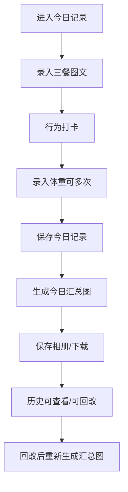
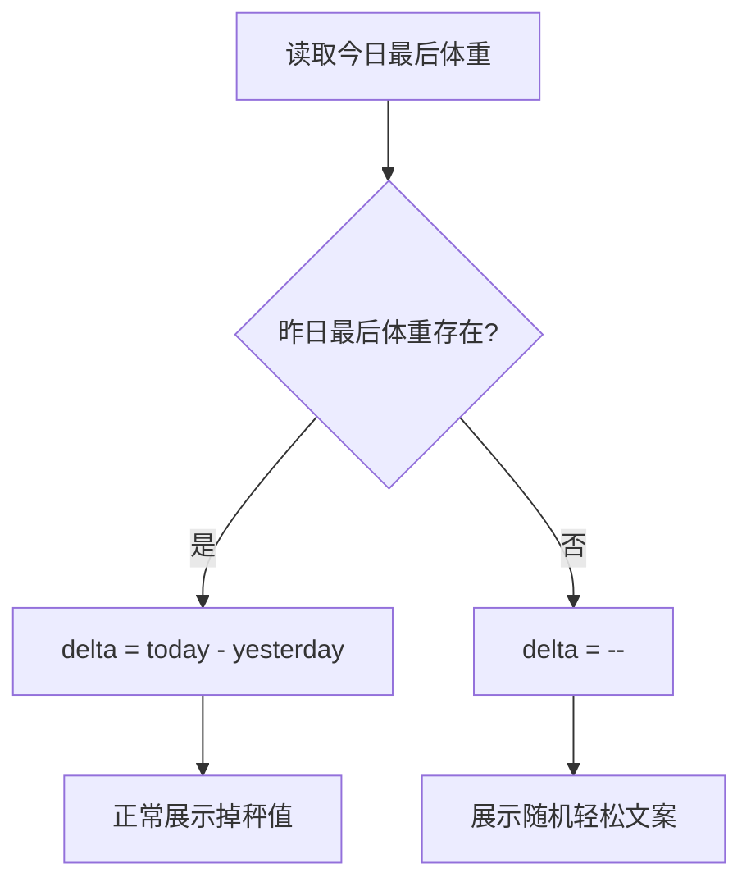
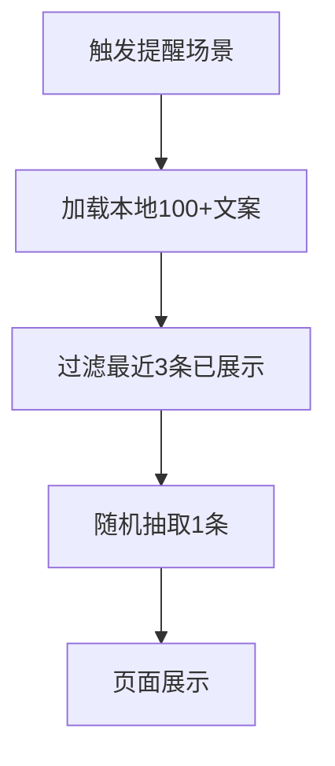

# 个人减脂记录 H5 + 后台管理（V1）PRD

- 文档版本：V1.0
- 日期：2026-05-26
- 产品形态：移动端 H5（日常使用）+ PC 后台 HTML（数据管理）
- 部署形态：本地服务 + 本地数据库（单用户）

## 1. 项目背景与目标

### 1.1 背景
用户需要一个轻量、可持续的个人减脂记录工具，核心是“低门槛记录三餐与行为打卡”，并能快速复盘与生成可视化总结图。

### 1.2 目标
1. 每日 1 分钟内完成核心记录（餐图+打卡+体重）。
2. 自动生成“今日汇总图”，用于自我复盘与留档。
3. 提供历史趋势查看与后台批量管理能力。

### 1.3 V1 不做
1. 多用户与登录鉴权。
2. 公网文案爬取与在线文案中心。
3. AI 热量识别与营养分析。

## 2. 用户与场景

### 2.1 用户
单用户（本人）使用。

### 2.2 高频场景
1. 早/午/晚三餐后拍照记录。
2. 晚上记录体重（可多次，最后一次为“今晚体重”）。
3. 睡前生成今日汇总图。
4. 每周查看历史达成与体重变化。

## 3. 信息架构

### 3.1 H5
1. 今日记录
2. 汇总预览
3. 历史记录
4. 我的（预留）

### 3.2 后台
1. 记录管理（列表）
2. 编辑记录（单日）
3. 系统设置
4. 数据导出

## 4. 页面需求

## 4.1 今日记录（H5）
- 顶部：标题、日期、宠物形象、轻松鼓励文案。
- 三餐记录：早餐/午餐/晚餐卡片。
  - 每餐最多 3 张图（显示 0/3~3/3）。
  - 每餐简短文本记录。
- 今日行为打卡：
  - 控制饮食（是/否）
  - 规律锻炼（是/否）
  - 规律作息（是/否）
- 体重记录：
  - 同日可多次新增/删除。
  - 展示时间与体重值。
  - 当日最后一条用于掉秤计算。
- 底部操作：
  - 保存今日记录
  - 生成今日汇总图

## 4.2 汇总预览（H5）
- 标题：今日总结、日期、Day X、较昨日体重变化。
- 内容区：
  - 三餐图片+每餐简短文字。
  - 三项行为达成状态。
  - 体重记录折线图（按时间点）。
- 操作：
  - 保存到相册
  - 下载图片
  - 返回编辑

## 4.3 历史记录（H5）
- 月份切换（上月/下月）。
- 日列表字段：
  - 日期、星期
  - 三餐图片状态
  - 三项打卡状态
  - 当日最终体重（无则 `--`）
- 图例：有/无三餐图、有/无体重、达成/未达成。

## 4.4 后台记录管理（PC）
- 日期区间筛选、按日搜索。
- 列表字段：
  - 日期
  - 三餐图片缩略图
  - 三餐记录状态
  - 三项打卡状态
  - 体重记录（最后）
  - 操作（编辑/查看/删除）
- 支持分页。

## 4.5 后台编辑记录（PC）
- 编辑对象：单日记录。
- 区块：
  - 三餐记录（图+文）
  - 今日行为打卡
  - 体重记录（增删）
- 操作：保存、取消。

## 4.6 系统设置与导出（PC）
- 开始记录日：可设置/重置。
- 导出：CSV（文字结构化数据），图片按日期目录归档。

## 5. 核心业务规则

1. 每餐最多上传 3 张图片。
2. 每日体重可多次记录，按当日最后一次作为“今日体重”。
3. 掉秤计算：`delta = 今日最后体重 - 昨日最后体重`。
4. 昨日无体重：delta 显示 `--`。
5. Day X 计算：按“开始记录日”到当前日期的自然日差 + 1。
6. 开始记录日重置后，Day X 全部按新起点重算。
7. 历史修改后允许重新生成汇总图。

## 6. 轻松提醒文案需求（新增）

1. 文案随机展示。
2. V1 内置本地文案库（100+ 条）。
3. V1 不接入公网爬取。
4. 默认触发场景：
  - 昨日无体重，无法计算掉秤时。
5. 随机策略建议：最近 3 条去重（防连续重复）。

## 7. 字段字典（Data Dictionary）

## 7.1 daily_records（每日记录）
| 字段 | 类型 | 必填 | 说明 |
|---|---|---|---|
| date | TEXT(YYYY-MM-DD) | 是 | 主键，记录日期 |
| diet_done | INTEGER(0/1) | 是 | 控制饮食是否达成 |
| exercise_done | INTEGER(0/1) | 是 | 规律锻炼是否达成 |
| sleep_done | INTEGER(0/1) | 是 | 规律作息是否达成 |
| note | TEXT | 否 | 当日总结 |
| summary_image_path | TEXT | 否 | 今日汇总图路径 |
| created_at | TEXT(ISO) | 是 | 创建时间 |
| updated_at | TEXT(ISO) | 是 | 更新时间 |

## 7.2 meal_records（三餐记录）
| 字段 | 类型 | 必填 | 说明 |
|---|---|---|---|
| id | INTEGER | 是 | 主键 |
| date | TEXT | 是 | 所属日期 |
| meal_type | TEXT | 是 | breakfast/lunch/dinner |
| note | TEXT | 否 | 本餐简短记录 |
| updated_at | TEXT(ISO) | 是 | 更新时间 |

## 7.3 meal_images（三餐图片）
| 字段 | 类型 | 必填 | 说明 |
|---|---|---|---|
| id | INTEGER | 是 | 主键 |
| meal_record_id | INTEGER | 是 | 关联 meal_records.id |
| file_path | TEXT | 是 | 图片存储路径 |
| sort_order | INTEGER | 是 | 展示顺序 |
| created_at | TEXT(ISO) | 是 | 创建时间 |

## 7.4 weight_logs（体重日志）
| 字段 | 类型 | 必填 | 说明 |
|---|---|---|---|
| id | INTEGER | 是 | 主键 |
| date | TEXT | 是 | 记录日期 |
| weight | REAL | 是 | 体重（kg） |
| recorded_at | TEXT(ISO) | 是 | 记录时间 |

## 7.5 settings（系统设置）
| 字段 | 类型 | 必填 | 说明 |
|---|---|---|---|
| id | INTEGER | 是 | 固定 1 |
| start_date | TEXT | 是 | 开始记录日 |
| updated_at | TEXT(ISO) | 是 | 更新时间 |

## 7.6 reminder_copies（本地文案库，文件）
| 字段 | 类型 | 必填 | 说明 |
|---|---|---|---|
| id | INTEGER | 是 | 文案ID |
| text | TEXT | 是 | 文案内容 |
| tag | TEXT | 否 | 场景标签（可选） |

## 8. 接口清单（API）

## 8.1 今日与单日
1. `GET /api/today?date=YYYY-MM-DD`
- 返回：当日完整数据（daily + meals + weight logs + delta + dayIndex）。

2. `GET /api/day/:date`
- 返回：指定日期完整详情。

3. `PUT /api/daily/:date`
- 入参：`diet_done, exercise_done, sleep_done, note`
- 出参：更新后的当日详情。

## 8.2 三餐
4. `PUT /api/meals/:date/:mealType`
- 入参：`note`
- 说明：保存本餐文字。

5. `POST /api/meals/:date/:mealType/images`
- 入参：multipart `file`
- 说明：上传图片，后端校验不超过3张。

6. `DELETE /api/meals/images/:imageId`
- 说明：删除单张图片。

## 8.3 体重
7. `POST /api/weights/:date`
- 入参：`weight`
- 说明：新增体重记录。

8. `GET /api/weights/:date/delta`（可选）
- 出参：`todayWeight, yesterdayWeight, delta`

## 8.4 汇总图
9. `POST /api/summary/:date`
- 入参：`dataUrl`（前端Canvas导出）
- 出参：`url`

## 8.5 历史与设置
10. `GET /api/history?from&to`
- 返回区间历史列表。

11. `GET /api/settings`
- 返回：`start_date` 等设置。

12. `PUT /api/settings/start-date`
- 入参：`start_date`

## 8.6 导出
13. `GET /api/export/csv?from&to`
- 返回 CSV 下载流。

## 9. 状态流转图

## 9.1 每日记录状态流

## 9.2 掉秤计算流

## 9.3 文案随机流

## 10. 验收标准（UAT）

1. 每餐上传第4张时必须拦截并提示。
2. 同日录入多条体重后，最后一条参与掉秤计算。
3. 昨日无体重时，展示 `--` 且出现随机提醒文案。
4. 文案库条数不少于100条，且不依赖网络。
5. 保存后历史页能看到当日状态与最终体重。
6. 生成汇总图成功，可保存/下载。
7. 后台编辑后，H5同日期展示更新。

## 11. 非功能需求

1. 移动端优先，关键交互点击区域 >= 44px。
2. 页面首屏加载目标 < 2s（本地环境）。
3. 图片压缩与懒加载，防止页面卡顿。
4. 本地数据库可靠落盘，可导出备份。

## 12. 开发排期（建议）

## Sprint 1（第1-2天）
1. 数据库与基础 API（daily/meals/weights/settings）。
2. 今日记录页打通（增删改查）。

## Sprint 2（第3-4天）
1. 汇总预览页与图片生成功能。
2. 历史记录页（月维度列表）。
3. 随机轻松文案（本地100+）。

## Sprint 3（第5-6天）
1. 后台记录管理与编辑页。
2. 系统设置（开始记录日）与CSV导出。
3. 联调与数据一致性校验。

## Sprint 4（第7天）
1. UI细节优化与性能优化。
2. UAT回归测试与交付。

## 13. 风险与对策

1. 图片存储膨胀：增加压缩与尺寸限制。
2. 历史修改一致性：编辑后强制刷新汇总缓存。
3. 文案重复感：加入最近N条去重策略。

## 14. 交付物清单

1. 可运行 H5 与后台管理页面。
2. SQLite 数据库结构与初始化脚本。
3. API 文档与 Postman 集合（可选）。
4. 本地文案库（100+条）。
5. 本 PRD 文档。
